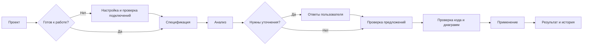

# Web-интерфейс LikeC4 AI Assistant: UX-аудит и план доработок

Дата: 7 сентября 2026. Статус: первый инкремент реализован (критичные состояния и основа интерфейса); следующие этапы остаются в плане.

## Выполнено: первый инкремент, 7 сентября 2026

- Тёплая палитра и общие стили, боковая навигация, контекст проекта, вкладки доступных результатов задачи и адаптивная компоновка.
- Обзор с готовностью модели/Confluence/AI, задачами, ожидающими решения, и последними запусками. Поиск проектов и новые пустые состояния.
- Первичный GET и обработка ошибок задач; один SSE-поток на задачу и периодическая синхронизация активных/ожидающих задач. Исправлено сохранение активного этапа на сервере до его выполнения.
- Явные сведения о завершённых этапах без ложного завершения будущих пустых гейтов; диагностики с файлами, строками и правилами на анализе и применении.
- Ошибки сохранения решений показываются у предложения. Редактор закрывается после успешного ответа, при ошибке текст остаётся. Фоновые ошибки обновления не скрывают уже загруженную задачу.
- Подготовка проекта проверяет также AI и модель; запуск недоступен при незавершённой настройке.
- Вместо плавающего тура — краткое встроенное знакомство из трёх шагов. Помощь закрывается по Escape, клику снаружи и потере фокуса, доступна на узком экране.
- Добавлен fallback для прямых web-ссылок при запуске собранного приложения; неизвестные API-адреса остаются ошибкой 404.

Проверено: lint, typecheck, production build, весь существующий набор тестов и новые проверки проекции сессии, сохранения активного этапа, SSE status/final snapshot. В браузере на отдельной базе проверены обзор, переход к решениям, успешное сохранение правки, сохранность черновика после ошибки API, диагностики, отсутствующая задача, прямые ссылки и ширина 390 px без переполнения страницы.

Ещё не реализовано: пять концептуальных этапов с новым контрактом review, отдельная предварительная проверка URL спецификации, список/детали и фильтры предложений, построчный diff, расширенный просмотр диаграмм и предварительный обзор восстановления. Текущая автогенерация после последнего решения сохранена. Этап 0 воплощён рабочими экранами; этапы 1–2 выполнены в описанном выше объёме, полная приёмка всего плана остаётся этапом 5. Реальные Confluence и LLM при проверке не использовались.

## 1. Вывод

Приложение уже покрывает содержательную часть сценария: подключение архитектуры, анализ спецификации, уточняющие вопросы, предложения с объяснениями, проверка кода, просмотр диаграмм, применение и восстановление. Главный недостаток — пользователь должен самостоятельно собрать эти возможности в последовательный рабочий процесс.

Рекомендуемая концепция: **рабочее пространство архитектора с понятным следующим действием**. На каждом экране видно, в каком проекте и задаче находится пользователь, что уже сделано, что требует решения и что произойдёт после нажатия основной кнопки.

Визуальное направление — светлый тёплый интерфейс по референсу: кремовые поверхности, графитовая типографика, сдержанный оранжевый акцент. Сначала исправить разрывы сценария и достоверность статусов, затем последовательно применить дизайн ко всем экранам.

## 2. Что изучено и ограничения

- Прочитаны все 14 экранов `apps/web/src/pages`, маршрутизация, layout, компоненты вопросов и предложений, контекстная помощь и onboarding; проверены связанные API создания проекта, сессий, решений и восстановления.
- В браузере проверены первый вход, создание отдельного демонстрационного проекта, обзор валидной модели, переход к новой задаче без подключений и открытие предложений несуществующей задачи. Визуальная проверка — окно 1280 × 720.
- Демонстрационный проект содержит два сервиса, одну связь и одну диаграмму; база, ключ и модель размещены отдельно в `/tmp/likec4-ux-review`. Пользовательские подключения не использовались.
- Полный анализ с реальными Confluence и LLM не запускался. Выводы об анализе, предложениях, diff, preview и apply основаны преимущественно на коде и API, а не на полном сквозном прогоне. Мобильная компоновка и screen reader требуют отдельной проверки при реализации.
- Вложение использовано как визуальный референс. Надписи на изображении и положения старого плана разработки не рассматриваются как новые поручения пользователя.

## 3. Пользователь и основной сценарий

Основная аудитория: системный аналитик или архитектор, который работает с существующей LikeC4-моделью и хочет перенести изменения из спецификации без дубликатов и потери контроля. Второй важный сценарий — вернуться к незавершённой проверке спустя время.

Текущий путь:

`Проекты → Создать проект → Обзор → Confluence → Обзор → AI-провайдер → Обзор → Новая задача → Анализ → Уточнения → Предложения → Анализ → Diff → Preview → Apply → История`

Настройки сохраняются для повторных запусков; вопросы возникают по необходимости. Возвраты в обзор и анализ нужны для навигации, хотя не представляют отдельной пользовательской цели.

Предлагаемый путь:

Внутри задачи — пять пользовательских этапов: **Спецификация → Анализ → Решения → Проверка → Результат**. Уточнения показываются внутри анализа, применение — как основное действие этапа проверки. Технический список стадий сохраняется в раскрываемом журнале.

Возврат к работе: `Проект → Требует решения / Последние задачи → Продолжить`. Открывается актуальное действие: ответить на вопросы, проверить предложения или применить готовые изменения.

## 4. Что уже есть и стоит сохранить

- Объяснения «что / почему / эффект», допущения, источники и оценка уверенности у предложений.
- Возможность принять, отклонить, изменить код и перегенерировать предложение.
- Явные ответы «Не знаю» и «Отложить» для неоднозначностей.
- Проверка подключений при сохранении настроек.
- Серверные механизмы проверки перед применением, снимок состояния и восстановление.
- История сессий и снимков, базовый просмотр SVG с масштабированием.
- Единая структура ошибок и реестр контекстной помощи.

Редизайн должен сохранить объяснимость: в подробностях выбранного предложения источники и обоснование доступны сразу. Длинный код и технические журналы можно раскрывать отдельно.

## 5. Проблемы и рекомендации

P0 — неверное состояние или тупик основного сценария; P1 — существенное улучшение повседневной работы; P2 — расширение продукта.

| Приоритет | Наблюдение и основание | Влияние | Рекомендация |
|---|---|---|---|
| P0 | `ProposalPage`, `DiffPage`, `PreviewPage`, `ApplyPage`, `HistoryPage` используют `isLoading || !data` без отображения ошибки запроса. Для отсутствующей задачи в браузере остаётся «Загружаем предложения…». | Ошибка выглядит как бесконечное ожидание. | Общие состояния loading / error / empty / ready; отдельный 404; повторить запрос и вернуться в проект. |
| P0 | `AnalysisPage` слушает только SSE `snapshot`, сервер между снимками отправляет `status`. Текущая стадия вычисляется по заполненности summary. | Прогресс может выглядеть застывшим или указывать неверную стадию. | Обрабатывать `status`, использовать серверный `currentStage`, отделить статус стадии от наличия результата; синхронизация после переподключения. |
| P0 | Пустой массив вопросов или предложений проходит `.every(...)`; такой результат сейчас используется как признак завершения этапа. | Будущие этапы могут преждевременно выглядеть выполненными. | Явный контракт состояний этапов, корректное отображение «не требуется» и «ещё не начато». |
| P0 | При отсутствии первого SSE-снимка показывается только «Подключаемся…». После восстановления соединения флаг ошибки не сбрасывается на новом снимке. | Нельзя отличить отсутствующую задачу от потери связи. | Первичная загрузка через GET, затем SSE; обработка 404, восстановления связи и актуальности данных. |
| P0 | На странице предложений не отображаются ошибки принятия и перегенерации. Редактор закрывается до подтверждения сохранения. | Пользователь не понимает, сохранилось ли решение или правка. | Ошибка рядом с выбранным предложением, сохранение черновика, закрытие редактора после успеха. |
| P0 | При блокировке Apply пользователь направляется к анализу за диагностикой, но `SessionView` передаёт в основном счётчики проверок; полноценного списка проблем на анализе нет. | Невозможно понять, что именно исправить. | Передавать диагностики и findings: файл/строка/элемент/правило, важность, причина, доступное исправление. |
| P1 | В обзоре пять действий занимают одну строку; название демонстрационного проекта при 1280 px переносится на три строки. Общая ширина ограничена `max-w-4xl`. | Название и контекст вытесняются настройками; мало места для кода и графа. | Постоянная навигация проекта, одна основная кнопка в заголовке; расширяемое рабочее поле. |
| P1 | После создания проекта нет перечня готовности. `NewTaskPage` проверяет только наличие настроенного Confluence, AI проверяется позже на сервере. | Пользователь узнаёт о требованиях по одному через ошибки. | Setup checklist: папка, валидность модели, Confluence, AI. Различать «сохранено» и «доступно при последней проверке». |
| P1 | Новая задача принимает только ID страницы. | Нужно вручную извлекать ID, нельзя проверить, ту ли спецификацию выбрали. | Ввод URL или ID; предварительно показать название, версию и выдержку, затем запускать анализ. |
| P1 | В обзоре только счётчики модели, задачи доступны через History. | Сложно вернуться к незавершённой работе. | Блок «Требует вашего решения», последние задачи, статус и кнопка «Продолжить». Использовать имеющуюся историю. |
| P1 | На анализе длинный перечень внутренних этапов, вопросы и переходы расположены ниже. | Главное действие теряется среди технических деталей. | Крупный текущий статус и действие сверху, пять этапов, журнал по раскрытию. Не показывать выдуманный процент выполнения. |
| P1 | Предложения — длинная вертикальная лента с равновесными действиями, без фильтров. Источники представлены текстом. | С ростом числа предложений сложно сравнивать и не пропускать решения. | Список слева, выбранное предложение справа; фильтры по решению/типу/риску, счётчик оставшихся, ссылки на источники при наличии адреса. |
| P1 | Последнее решение автоматически продолжает pipeline; UI сообщает об этом по факту принятых решений, даже если возобновление на сервере не удалось. | Момент перехода и возможность пересмотра решения неясны. | Явная кнопка «Проверить выбранные изменения», серверное подтверждение перехода и ограничение редактирования после него. Это изменение API, не только кнопка. |
| P1 | Diff показывает полные тексты до/после с окраской всего блока. | Трудно найти несколько изменённых строк в большом файле. | Построчный diff, номера строк, сворачивание неизменённого, список файлов, режимы рядом/единый. |
| P1 | Preview — итоговый SVG, масштаб через ширину картинки и прокрутку. | Неясно, что именно изменилось; трудно ориентироваться в большой схеме. | «Вписать», сброс, полноэкранный просмотр, затем сравнение до/после и выделение затронутых элементов. |
| P1 | Rollback и Restore запускаются сразу по кнопке, без предварительного описания конкретного восстановления. | Пользователь не видит, какие файлы и позднейшие правки будут затронуты. | Перед восстановлением показать дату, список затрагиваемых файлов и последствия; подтверждение именно этой операции. |
| P1 | 13-шаговое введение появляется поверх страниц и не отслеживает фактическое выполнение настройки. | Обучение отделено от действий, может закрывать содержимое. | Краткое необязательное знакомство плюс встроенный checklist; помощь по текущему действию. |
| P1 | Смешаны History, Apply, Rules, Views и русский язык; помощь имеет зону 16 × 16 px; поля иногда подписаны только placeholder. | Больше усилий на чтение и управление с клавиатуры/касанием. | Единый словарь, подписи полей, видимый focus, увеличенные зоны нажатия, доступные popover/dialog. |

## 6. Предлагаемая структура интерфейса

**Навигация проекта:** Обзор, Задачи, Архитектура, Правила, История, Настройки. Вверху — переключатель проекта; помощь доступна постоянно. «Архитектура» — отдельное расширение: сейчас обзор показывает статистику, но не текущие диаграммы. В первом релизе этот раздел не должен вести на пустой экран.

**Обзор:** название и краткое описание; кнопка «Новый анализ»; готовность подключений; задачи, ожидающие решения; последние запуски. Счётчики элементов и связей — вторичная информация. Для нового проекта главная кнопка «Завершить настройку».

**Настройки:** Общие / Confluence / AI. Правила остаются отдельным рабочим разделом. Расширенные параметры подключения раскрываются по необходимости. Сохранение настроек не должно стирать введённый URL спецификации при возврате к задаче.

**Рабочее пространство задачи:** breadcrumb «Проекты / Payments / Название спецификации», статус, пять этапов, контекст справа при необходимости. В стадии проверки вкладки «Сводка / Код / Диаграммы / Проверки». Переключение вкладок сохраняет выбранный файл и диаграмму.

**Предложения:** компактный список с типом и статусом; справа объяснение, источники, допущения и код выбранного пункта. Закреплённая панель «Решено 8 из 12». Одно доминирующее действие; отклонение предложения не должно выглядеть как опасное удаление данных.

**Применение:** явно указать целевой проект и папку, число файлов и решений, результаты проверок. Кнопка «Применить изменения в 3 файлах». После успеха — перечень изменённых файлов, время, ссылка на снимок и «Вернуться в проект». Отдельно отобразить «Восстановлено», а не одновременно показывать старое «Применено» и сообщение об откате.

**История:** человекочитаемые статусы, поиск, фильтр по результату, связь задачи со снимком. При переходе из истории открывается актуальный этап задачи; восстановление вынесено в подробности снимка.

## 7. Визуальная система

Apple HIG использовать как источник принципов и поведения, а для web реализовать собственные токены и компоненты. Краткое необязательное введение соответствует [HIG Onboarding](https://developer.apple.com/design/human-interface-guidelines/onboarding). Семантическое применение цвета и доступность — ориентиры из [HIG Color](https://developer.apple.com/design/human-interface-guidelines/color) и [HIG Accessibility](https://developer.apple.com/design/human-interface-guidelines/accessibility).

Предлагаемая адаптация референса, не точное извлечение цветов со скриншота:

| Токен | Значение | Применение |
|---|---|---|
| canvas | `#FAF8F4` | Общий тёплый фон |
| surface | `#FFFFFF` | Формы, таблицы, карточки |
| surface-warm | `#FCEBD0` | Введение, выделенная область сводки |
| text-primary | `#1D1D1F` | Заголовки и основной текст |
| text-secondary | `#66625B` | Пояснения |
| border | `#E6DFD5` | Ненавязчивые разделители |
| accent | `#C65B12` | Активный пункт, иконки, выделение |
| accent-strong | `#A6450A` | Ссылки и акцентная кнопка с белым текстом |
| accent-soft | `#FFF0DB` | Фон выбранного пункта |

Цвета — начальные значения для макетов. Перед реализацией проверить контраст всех фактических сочетаний, включая hover, disabled, focus и статусы. Основную кнопку можно оставить графитовой: это поддержит чёрную типографику референса. Зелёный, красный и янтарный сохраняются для семантики успеха, ошибки и предупреждения; состояние дополнительно передаётся текстом и иконкой.

- Шрифт интерфейса: `-apple-system, BlinkMacSystemFont, "Segoe UI", sans-serif`. На Apple-платформах используется системный шрифт без включения его файлов в приложение. Код: `ui-monospace, SFMono-Regular, Menlo, Consolas, monospace`.
- Основной текст 15–16 px, пояснения 13–14 px, заголовки страниц 28–32 px; code 13–14 px. Не строить иерархию на малоконтрастном тексте 10–12 px.
- Сетка отступов: 4 / 8 / 12 / 16 / 24 / 32 / 48 px. Скругления: поля и кнопки 10–12 px, панели 16–20 px, статусы — capsule.
- Sidebar около 224–240 px, формы до 640–720 px, рабочие области кода и диаграмм используют оставшуюся ширину. На узком экране список и детали переключаются последовательно.
- Крупные зоны нажатия около 44 px для основных действий и touch; компактные desktop-кнопки допустимы с достаточной зоной попадания. Помощь визуально может оставаться маленькой, область нажатия — больше.
- Точечную сетку из референса использовать деликатно на пустом canvas или в приветствии. Для текста, таблиц и кода — ровная поверхность. Огромные скругления референса уменьшить до масштаба рабочего инструмента.
- Небольшие анимации переходов 120–180 ms и поддержка `prefers-reduced-motion`; фокус и изменение статуса не должны зависеть от анимации.
- Явные состояния компонентов: default / hover / focus / selected / disabled / loading / error. У popover — Escape и предсказуемое закрытие; у диалогов — возврат фокуса.

Словарь интерфейса: «Задача», «Предложения», «Изменения», «Диаграммы», «Применить», «Восстановить», «Правила архитектуры», «История». Pipeline и stage остаются в техническом журнале. «Backend в порядке» заменить на компактное «Сервис доступен» с подробностями по запросу.

## 8. Каких возможностей не хватает

**Для уверенного ежедневного использования:** готовность проекта до запуска; продолжение задач из обзора; URL спецификации и проверка выбранной страницы; видимые ошибки и диагностики; достоверный прогресс; удобный review большого числа предложений; явное завершение проверки; понятное восстановление.

**Следующая очередь:** просмотр текущей архитектуры без запуска анализа, редактирование названия/описания/пути проекта, архивирование проектов, экспорт diff/отчёта, поиск по истории, сохранение черновика задачи. В существующих project routes есть создание и чтение, поэтому управление проектом потребует API.

**После отдельной проверки потребности:** ввод спецификации текстом/файлом, несколько источников в одной задаче, пакетные решения, управление остановкой и возобновлением анализа, совместная проверка, создание PR. Это расширяет текущий локальный продукт; не включать всё в первый редизайн.

Пакетное принятие допустимо только с явным выбором пунктов и понятной областью действия. Остановку/возобновление нельзя обещать одной UI-кнопкой: нужны серверные гарантии сохранения результатов и отсутствия дублирующей записи.

## 9. План реализации

Оценка ниже — предварительная трудоёмкость одного разработчика, знакомого с React/TypeScript и проектом, при доступных дизайн-решениях и тестовых подключениях. Это не календарное обязательство; после прототипа и уточнения API оценку пересмотреть.

| Этап | Содержание | Зависимость | Оценка | Критерий готовности |
|---|---|---|---|---|
| 0. Зафиксировать сценарии и макеты | Обзор, настройка, анализ с вопросом, review, проверка/apply, ошибка и восстановление; токены и словарь | Аудит | 2–3 дня | На сценариях понятно текущее состояние, следующее действие и результат; проверены длинные названия и большой список предложений |
| 1. Исправить P0 | Ошибки чтения/мутаций, SSE, первичная загрузка, состояния этапов, диагностики, сохранение правок | Можно начать сразу; контракт диагностик согласовать до UI | 3–5 дней | 404/500/offline не превращаются в вечную загрузку; этапы обновляются; причина запрета применения доступна |
| 2. Основа интерфейса и первый запуск | Общие компоненты, токены, responsive layout, навигация, checklist, обзор с задачами | 0; инфраструктура ошибок из 1 | 4–6 дней | Новый пользователь видит недостающие подключения; возвращающийся открывает актуальное действие из обзора |
| 3. Единый сценарий задачи | URL/ID и preview спецификации, пять этапов, вопросы, список/детали предложений, фильтры, явный переход к проверке | 1–2; новые API preview/завершения review | 5–8 дней | Решения сохраняются; ошибки видны; последний ответ не вызывает неожиданный переход; обновление страницы восстанавливает контекст |
| 4. Проверка и применение | Построчный diff, базовые улучшения SVG, подробные проверки, сводка применения, подтверждение восстановления | 1–3; API диагностик и сведений о восстановлении | 4–6 дней | Пользователь находит изменённые строки, видит блокирующие причины и понимает последствия записи/восстановления |
| 5. Приёмка | Сквозные тесты, клавиатура, контраст, узкие окна, длинные документы; обновление помощи | 1–4 | 2–3 дня | Основной и аварийные сценарии проходят; справка соответствует UI |

Итого для основного редизайна: **20–31 человеко-день**, без расширенного интерактивного графа, совместной работы и новых источников. Первый полезный инкремент — этапы 0–2: **9–14 человеко-дней**.

## 10. Техническая декомпозиция

Использовать существующие React, Tailwind и React Query. Для основного редизайна миграция фреймворка не нужна.

| Область | Изменения |
|---|---|
| `apps/web/src/index.css`, `tailwind.config.js` | Семантические CSS-переменные и шкалы размеров/типографики |
| `apps/web/src/components/Layout.tsx`, `App.tsx` | ProjectLayout / TaskLayout, навигация, breadcrumbs, fallback 404, сохранение старых deep links |
| `apps/web/src/ui-kit` | Button, Field, StatusBadge, Alert, EmptyState, Dialog, Tabs, ProgressSteps, PageHeader; повторное использование ErrorState |
| `ProjectsPage`, `ProjectDashboardPage`, `CreateProjectPage`, настройки | Готовность, первый запуск, последние задачи, единая компоновка форм |
| `AnalysisPage`, API client | Общий hook сессии: GET + SSE + восстановление; обработка статуса и доступных действий |
| `ProposalPage`, `ProposalItemCard`, `QuestionCard` | Разделение списка/деталей, фильтры, сохранение правок, ошибки мутаций, явный submit review |
| `DiffPage`, `PreviewPage`, `ApplyPage`, `HistoryPage` | Единая проверка, построчный diff, доступные controls, итог и восстановление |
| `apps/server/src/routes/sessions.ts` и доменные DTO | Диагностики, текущая стадия/состояния, сведения об источнике и допустимых действиях; без раскрытия секретов |
| `apps/server/src/routes/proposals.ts` | Отдельное завершение review, проверка допустимого состояния, защита от повторного запуска; согласованность изменённых решений и сгенерированных файлов |
| API проекта / Confluence | Предварительная проверка спецификации и статусы готовности; позже редактирование/архивирование |
| Help / onboarding / `docs/user-guide` | Обновить тексты и привязки; сохранить проверку полноты справки при lint |

Достоверность статусов и серверные ограничения важнее визуально активной/неактивной кнопки: UI должен отражать доступные действия, а API повторно проверять их. При изменении решения после генерации требуется явное аннулирование зависимых результатов или запрет правки с понятным объяснением.

## 11. Приёмочные сценарии и проверка пользы

1. Первый вход → создание проекта → видны недостающие подключения → после настройки можно запустить анализ без поиска инструкций в справке.
2. Ввод поддерживаемого URL или ID → показаны заголовок и версия спецификации → неверный/недоступный источник объяснён до запуска анализа.
3. Анализ с уточнениями → ответ, «Не знаю», «Отложить» → видны последствия решения и актуальное состояние.
4. Закрытие/перезагрузка вкладки во время анализа и review → открывается та же задача с сохранёнными сервером решениями.
5. Потеря сети, 404 и 500 на каждом экране → сообщение и подходящее следующее действие; сохранённые данные не исчезают.
6. Ошибка сохранения правки предложения → редактор и текст остаются доступны; повторная отправка не теряет изменение.
7. Нет предложений / всё отклонено / нет diff / нет views → объяснение результата и выход в проект, без ложной необходимости применения.
8. Есть блокирующая диагностика → видно правило/файл/причину; применение недоступно и на API. Одни предупреждения отображаются отдельно.
9. Внешнее изменение файлов после анализа → понятный конфликт и путь к повторной проверке, без обещания безусловной записи.
10. Успешное применение → конкретный результат и снимок; восстановление → сначала последствия, затем однозначное состояние «Восстановлено».
11. Review 50 предложений, diff 20 файлов, длинные пути и имена → основное действие доступно, есть фильтрация и понятная навигация.
12. Окна 1440, 1024, 768 и 390 px; клавиатура, масштаб текста 200%, screen reader и reduced motion → основные действия доступны, горизонтальная прокрутка ограничена кодом/схемой.

Для реализации: сфокусированные тесты контрактов SSE/стадий и переходов review, компонентные тесты ошибок и сохранения правки, сквозные тесты на детерминированных Confluence/LLM fixtures. Затем lint, typecheck, релевантные тесты и сборка. При доступных подключениях — отдельный smoke test реальных интеграций. На этапе исходного аудита код приложения не менялся и тесты не запускались; результаты проверки первого инкремента приведены в начале документа.

Для оценки UX провести 3–5 коротких наблюдаемых сессий с аналитиками/архитекторами на одинаковой спецификации. Сравнить время до первого успешного запуска, время поиска незавершённой задачи, пропущенные решения, ошибки навигации и понимание последствий применения. Сначала снять baseline; численные обещания ускорения до измерения не делать.

## Второй инкремент — проверка решений и сравнение кода

Реализованы список предложений с подробностями, поиск и фильтры по типу и решению; открытые черновики сохраняются при переключении пунктов. Сводка показывает прогресс и отдельное подтверждение всего набора перед генерацией. API проверяет актуальность версии, запрещает повторный запуск и изменения после подтверждения, сериализует конкурирующие изменения решений. При ошибке предварительной проверки решения остаются сохранёнными.

Diff показывает номера строк, добавления и удаления, сворачиваемый контекст, выбор файла и полные тексты до/после. Для больших блоков ограничена стоимость поиска совпадений без потери содержимого.

Проверены серверные переходы и конкурентное подтверждение, восстановление старых сессий, точность сравнения строк; lint, typecheck, тесты и сборка проходят. В браузере проверены сохранение черновика при переключении, отсутствие автоматического запуска после последнего решения, ошибка подключения при подтверждении и переключение режимов diff. При ширине 390 и 1280 px страница diff не имеет горизонтального переполнения. Реальные Confluence/LLM в демонстрации не подключались.

Следующие части плана: предварительная проверка спецификации, улучшение диаграмм, сценарии отсутствия изменений, последствия применения и восстановления снимков.
